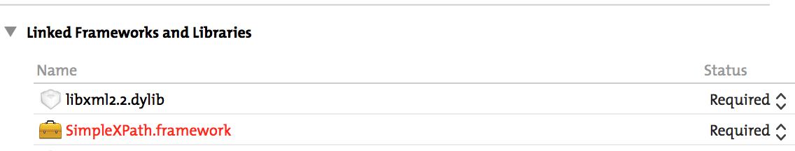
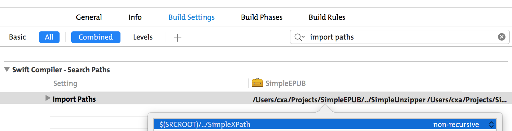

# SimpleXPath

Locate XML Element and evaluate XPath Function. Written in Swift 1.2.

## Installation

`SimpleXPath` is based on `libxml2`.

Drag `SimpleXPath.xcodeproj` into your project, add `SimpleXPath.framework` and `libxml2.2.dylib`to “Linked Frameworks and Libraries” under “General” tab of target settings. 

 Because currently Xcode doesn't support 3rd C libs directly inside a framework, install `SimpleXPath` is a little tricky. To make it work, don't forget to add correct path which contains `SimpleXPath` to target's `Build Settings` -> `Swift Compiler - Search Paths` -> `Import Paths`. As below shows, `SimpleXPath` is on the same directory as the target project.

If you add `SimpleXPath` inside your project dirctory, the `Import Paths` should be `$(SRCROOT)/SimpleXPath`

## Example

Consider following XML:

	<?xml version="1.0" encoding="utf-8"?>
	<feed>
	  <title>Example Feed</title>
	  <entry>
	    <link href="http://example.org/2003/12/13/atom03"/>
	    <link rel="alternate" type="text/html" href="http://example.org/2003/12/13/atom03.html"/>
	    <link rel="edit" href="http://example.org/2003/12/13/atom03/edit"/>
	    <author>
	      <name>John Doe</name>
	      <email>johndoe@example.com</email>
	    </author>
	  </entry>
	</feed>

### Create a XML Document

	let doc = XMLDocuemnt(string: xmlStr)
	
### Locating All Elements

	let links = doc?.selectElements('//links')
	
or more spefic:

	let links = doc?.selectElements('/feed/entry/links')
	
This will return a sequence of `XMLElement`, you can use `for link in links { ... }` to iterate each element.
	
### Locating First Element

	let el = doc?.selectFirstElement("/feed/entry/link")
	
This will return first `XMLElement` for `link` under `/feed/entry`.

### Evaluate XPath Function

	let result = doc?.evaluate("count(/feed/entry/link)")
	
This will return a `XPathFunctionResult`, its an `enum` and contains double value 3.

You can find more usage under test cases.

## `XMLElement`

You can also apply XPath to `XMLElement`. Using below properties and or methods to access informations.

	var tag: String? { get }
    var content: String? { get }
    var parent: XMLElement? { get }
    var children: SequenceOf<XMLElement>? { get }
    var prev: XMLElement? { get }
    var next: XMLElement? { get }
    var attributes: SequenceOf<XMLAttribute>? { get }
    func valueForAttribue(attr: String, inNamespace nspace: String? = default) -> String?
    
## Default Namespaces

In real world, most XML document contains one or more default namespaces, e.g. Atom document will look like this:

	<feed xmlns="http://www.w3.org/2005/Atom" xmlns:dc="http://purl.org/dc/elements/1.1/">
	
All elements without a prefix inside Atom document will be under the default namespace `http://www.w3.org/2005/Atom`. According to the XPath spec, you can't ignore the default namespace, XPath like `/feed/entry/links` won't work. You need to define a prefix for the default namespace such as `atom`, and reconstruct the XPath as `/atom:feed/atom:entry/atom:links`. `XMLDocument` provides a method for registering default namespace:

	func registerDefaultNamespace(namespaceHref: String, usingPrefix prefix: String)
	
The real usage will be `doc?.registerDefaultNamespace("http://www.w3.org/2005/Atom", usingPrefix: "atom")`.
	
For namespaces that contain a prefix such as `xmlns:dc="http://purl.org/dc/elements/1.1/"`, you don't need to do anything for XPath as `//dc:language`.
		
## About Me

* GitHub: <https://github.com/cxa>
* Twitter: [@_cxa](https://twitter.com/_cxa)
* Apps available in App Store: <http://lazyapps.com>
* PayPal: xianan.chen+paypal 📧 gmail.com, buy me a cup of coffee if you find it's useful for you.

## License

Under the MIT license. See the LICENSE file for more information. For non attributed commercial lisence, please contact me.